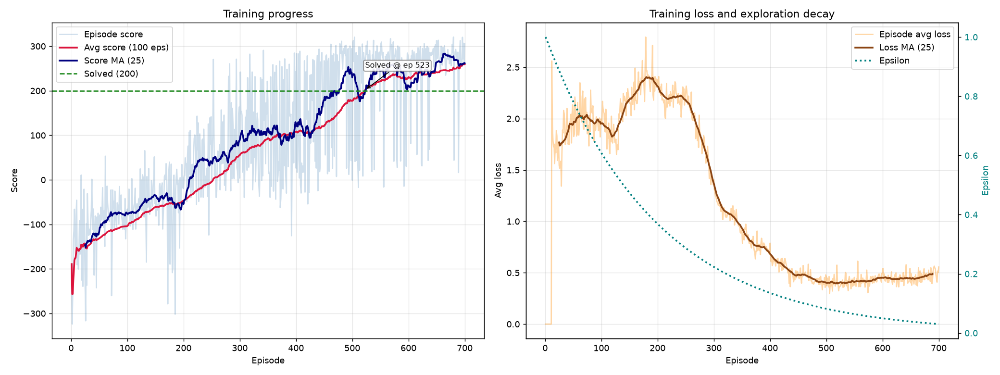
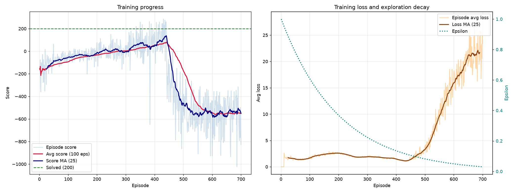

# DQN — Lunar Lander

A Double Deep Q-Network trained from scratch in PyTorch to land the Gymnasium `LunarLander-v3` craft, with experience replay, a soft-updated target network, a multi-seed experiment harness, and an ablation against vanilla DQN.




*Vanilla DQN, seed 44 — solved at episode 523. Loss settles to ~0.5 and stays there.*



*Double DQN, seed 42 — the same configuration, diverging. The score falls off a cliff at episode 440 and the loss leaves the range it held for the previous 400 episodes at exactly the same moment. Both panels are showing one event.*

---

## Results

Averaged over 3 seeds (42, 43, 44) at 700 episodes each, evaluated greedily on 100 seeded episodes:

| Policy | Eval mean ± std | Seeds solved | Median episode to solve |
|---|---|---|---|
| **Vanilla DQN** | **272.4 ± 1.4** | **3 / 3** | 523 |
| Double DQN | −453.8 ± 471.6 | 1 / 3 | 577 |
| Random baseline | −177.6 ± 112.5 | 0 / 3 | — |

The environment counts as solved at a 100-episode average of **200**. The random policy scores −177.6, so that row is what "no learning at all" looks like on identical starting conditions.

**Double DQN lost, and it lost badly.** That is the opposite of what I expected when I added it, so the per-seed numbers matter more than the aggregate:

| Seed | Vanilla DQN | Double DQN |
|---|---|---|
| 42 | 270.5 — 91% of episodes solved | −554.8 — 0% |
| 43 | 273.2 — 97% | −974.2 — 0% |
| 44 | 273.6 — 96% | 167.6 — 51% |

Vanilla is not just better on average, it is *stable*: three independent seeds land within 3.1 points of each other. Double DQN is bimodal — one seed solved the environment, two diverged outright. [What the ablation actually found](#what-the-ablation-actually-found) has the loss curves and what I think is behind it.

Every number traces to a JSON file written by the run that produced it: `runs/experiments/comparison.json`, `runs/baseline.json`. No figure in this README was typed by hand.

---

## The problem

LunarLander gives the agent an 8-dimensional state — position, velocity, angle, angular velocity, and two leg-contact flags — and four discrete actions: do nothing, fire left, fire main, fire right. Reward combines proximity to the pad, landing softly, fuel spent, and a terminal ±100 for landing or crashing. The environment is considered solved at an average score of 200 over 100 consecutive episodes.

## How it works

```
env.step ──> transition ──> replay buffer (100k, uniform sampling)
                                   │
                                   ▼
              minibatch of 64 ──> policy net ──> Q(s,a)
                                       │
              target net ──> max Q(s',a') ──> Bellman target
                                       │
                                 Huber loss ──> Adam ──> soft update target
```

Three decisions carry most of the stability:

**Two networks, not one.** The Bellman target is produced by a separate target network. With a single network the regression target shifts every time the weights update, and the agent chases its own estimate. The target here is soft-updated after each gradient step, `target ← τ·policy + (1−τ)·target` with `τ = 0.005`, so it tracks the policy network slowly instead of jumping on a fixed schedule.

**Uniform replay.** Consecutive transitions within an episode are strongly correlated, which breaks the i.i.d. assumption gradient descent relies on. Sampling uniformly from a 100k buffer decorrelates each batch. No gradient steps run until the buffer holds 1,000 transitions, because the first few hundred are near-random while ε ≈ 1.

**Huber loss and gradient clipping.** TD errors are occasionally very large early in training, and squaring them under MSE produces gradients big enough to destabilise the network. Smooth L1 is linear past δ = 1, and gradients are additionally clipped to norm 1.0.

## Architecture and hyperparameters

An MLP is enough here: the observation is already a low-dimensional physics vector with no spatial structure for a convolutional stack to exploit.

```
Linear(8 → 256) → ReLU → Linear(256 → 128) → ReLU → Linear(128 → 64) → ReLU → Linear(64 → 4)
```

| | |
|---|---|
| Optimiser | Adam, lr 5e-4 |
| Loss | Smooth L1 (Huber) |
| Discount γ | 0.99 |
| Batch size | 64 |
| Replay buffer | 100,000, warmup 1,000 |
| Target update | soft, τ = 0.005, every gradient step |
| Exploration | ε 1.0 → 0.01, ×0.995 per episode |
| Episodes | 700, max 1,000 steps each |
| Seed | 42 |

All of it lives in [`dqn/config.py`](dqn/config.py) as a frozen dataclass, and the full config is serialised into every run's summary JSON.

## Double DQN

Vanilla DQN computes its target as `r + γ · max_a' Q_target(s', a')`. The same network both chooses the best next action and estimates its value, and because `max` always takes the largest number, any upward noise in the estimate is preferentially selected. The result is a systematic upward bias that compounds every time the target is bootstrapped.

Double DQN splits the two roles:

```python
# vanilla: target net both selects and evaluates
q_next = target_net(next_states).max(dim=1)[0]

# double: policy net selects, target net evaluates
next_actions = policy_net(next_states).argmax(dim=1, keepdim=True)
q_next = target_net(next_states).gather(1, next_actions).squeeze(1)
```

Because the two networks' errors are not perfectly correlated, a spuriously high estimate in one is unlikely to be echoed by the other, and most of the overestimation cancels. It is roughly three lines of code, and it is the change most widely recommended for a vanilla DQN. That recommendation did not reproduce here — see below.

Toggle with `Config.double_dqn`; `python experiments.py --ablate` trains both arms under identical seeds so the Bellman target is the only difference between them.

### What the ablation actually found

It did not hold here. Vanilla scored **272.4 ± 1.4** and solved 3/3; Double scored **−453.8 ± 471.6** and solved 1/3.

The loss curves say what happened. Both failing Double runs learned normally at first — seed 42 reached a +53 running average by episode 400 — and then came apart:

```
double_dqn seed 42    loss   1.34   2.58   1.72   1.30    3.78    8.94   17.59   23.36
                      avg  100  -121    -32    +30    +54    -173    -469    -545    -550

vanilla    seed 42    loss   1.42   2.58   1.14   0.66    0.55    0.61    0.54    0.61
                      avg  100  -121    -26    +80   +107    +218    +242    +226    +198
```

A loss growing without bound while the score collapses is Q-value divergence: the value estimates run away, the policy follows them, and the lander ends up flying off firing engines — which is where the −5,000 episode scores come from. Double DQN did not fail to learn. It learned, then diverged.

I could not find a defect behind it. The implementation matches the standard formulation — policy net selects, target net evaluates, under `no_grad`, with the terminal bootstrap zeroed — and the suite covers exactly that: Double against vanilla target selection, and the one-sided overestimation gap between them. All 42 tests pass.

Two candidate explanations, neither of which this experiment settles:

- **Seed luck.** Three seeds split 2 diverged / 1 solved. Five more might tell a different story, and running seeds 45–47 on the Double arm is the first thing I would do next.
- **Interaction with the soft target update.** τ = 0.005 after every gradient step keeps the target network close to the policy network. Double DQN's benefit depends on the two networks' errors being *uncorrelated*; a target that closely tracks the policy net weakens precisely that, leaving the cost without the benefit. A periodic hard update, or a smaller τ, would test it directly.

What I have not done is quietly drop the arm and report the result I expected. The claim above is the textbook one and it is well supported in the literature. It did not reproduce on this configuration, at this episode budget, on these three seeds. That is the result.

## Running it

```bash
python -m venv .venv && .venv/Scripts/activate   # Windows
pip install -r requirements.txt
```

Train, evaluate, and get a floor to compare against:

```bash
python train.py
```

```bash
python evaluate.py --checkpoint runs/latest/dqn_lunarlander.pth --episodes 100
```

```bash
python baseline.py --episodes 100
```

Run the full multi-seed comparison that produces the results table:

```bash
python experiments.py --ablate --seeds 42 43 44
```

Tests:

```bash
pytest tests/ -v
```

`train.py` takes `--episodes`, `--seed`, `--lr`, `--out`. `evaluate.py` takes `--record` to save mp4s of the first three landings. Training writes four artifacts: weights, the training figure, a summary JSON, and the raw per-episode history as a compressed `.npz` so curves can be re-plotted without retraining.

## Tests

42 tests, passing in about 6 seconds. They cover the parts where a silent bug produces a plausible-looking agent that simply never learns:

| Suite | Covers |
|---|---|
| `test_agent.py` | Bellman target with and without terminal transitions, Double vs vanilla target selection, the one-sided overestimation gap, soft-update arithmetic, that a gradient step moves the policy net and **not** the target net, checkpoint round-trip |
| `test_replay_buffer.py` | Capacity bounds, oldest-first eviction, batch shapes, and the dtypes `gather` requires |
| `test_network_and_config.py` | Output shape, unbounded Q-values, gradient flow to every layer, config immutability and schedule sanity |

The most valuable test is `test_terminal_transition_drops_the_bootstrap`. Omitting the `(1 - done)` factor is the classic DQN bug: the agent keeps assigning value to a state that does not exist, training still runs, the loss still falls, and the agent just quietly never learns to land.

## CI

`.github/workflows/ci.yml` runs on every push:

1. **Lint and format** — `ruff check` and `ruff format --check`
2. **Unit tests** with coverage
3. **Smoke test** — two real training episodes against the actual environment, then evaluation of the checkpoint it produced, then an assertion that all five artifacts exist

The smoke job exists because unit tests mock the environment away. It catches import errors, shape mismatches, and broken artifact writes that the unit suite cannot see.

## Layout

```
dqn/
├── config.py         All hyperparameters, one frozen dataclass
├── network.py        Q-network
├── replay_buffer.py  Uniform experience replay
├── agent.py          Action selection, Bellman update, soft target update
└── utils.py          Seeding, device selection, plotting
train.py              Training loop + CLI, writes run artifacts
evaluate.py           Greedy evaluation on seeded episodes, optional video
baseline.py           Random-policy floor on the same seeded episodes
experiments.py        Multi-seed runner and Double-vs-vanilla ablation
tests/                pytest suite
notebooks/            The original Colab notebook, as submitted
```

## Team

Built for CSCI 3385 (Artificial Intelligence) by a team of three. Attribution is preserved in each module's docstring:

| | |
|---|---|
| **Victory Orobosa** | Q-network architecture, DQN agent (action selection, Bellman update, target maintenance), training loop |
| **Nicola** | Hyperparameter configuration, training plots, evaluation harness |
| **Pacifique** | Experience replay buffer |

The refactor from the submitted notebook into this repository is my own work.

## What changed after submission

The assignment was a single Colab notebook that trained an agent and printed some numbers. Turning it into something reproducible and defensible:

**Correctness and reproducibility**
- **Persisted the trained weights.** The original defined `save_model`/`load_model` but never called them, so nothing was ever saved and every evaluation required retraining first.
- **Seeded the evaluation episodes.** The original evaluated on 10 unseeded episodes, sampling different starting conditions every run, so the reported average moved each time it was run. Evaluation now uses 100 episodes seeded from a fixed offset, disjoint from the training seeds.
- **Removed `TARGET_UPDATE_FREQ`**, a hyperparameter defined but never read. The code always soft-updated after every gradient step; leaving the constant in implied a periodic hard update that was not happening.
- **Config and metrics serialise to JSON on every run**, so any number quoted anywhere traces back to the run that produced it.
- **Seeded the baseline's *policy*, not just its episodes.** This one was mine, not the notebook's, and it is the same bug as the one two entries above. `baseline.py` called `random.seed()` and reset each episode from a fixed offset, so the 100 starting positions were identical every run — but actions came from `env.action_space.sample()`, and a Gymnasium `Space` carries its own generator that `reset(seed=…)` does not touch. Starting conditions were pinned; the policy was not. It surfaced only because two people ran the same command and compared: −179.0 against −187.0. One line (`env.action_space.seed(seed)`) fixes it, and the baseline now returns −177.6 ± 112.5 on every run. Half-seeded is indistinguishable from seeded until someone checks.

**Rigour**
- **Double DQN**, with the vanilla path retained behind a flag so the two can be compared directly.
- **Multi-seed experiments.** A single RL run is close to meaningless — the same code on a different seed can plateau at 40 or reach 250. Results are now reported as mean and spread across seeds.
- **A random baseline** on identical seeded episodes, so a score has a floor to be measured against.
- **An ablation harness** that trains both Bellman variants under matched seeds and episode budgets, so the target computation is the only thing that differs.

**Engineering**
- Split into modules with a CLI, so a run is a command rather than a sequence of executed cells.
- A pytest suite over the Bellman update, the buffer, and the network contracts.
- GitHub Actions running lint, tests, and an end-to-end training smoke test.

## Limitations and next steps

- **No prioritised replay or dueling heads.** Prioritised experience replay is the natural next addition: sampling transitions in proportion to TD error concentrates learning on the surprising ones. Dueling architectures would help most in states where the action choice barely matters.
- **Three seeds is thin, and it is the limitation that most affects the headline result.** Five to ten would be a properly defensible benchmark; three is what fits in a reasonable CPU budget. It matters more than usual here because the Double arm split 2 diverged / 1 solved — a ratio three samples cannot pin down. The vanilla arm is on firmer ground: 270.5, 273.2 and 273.6 across independent seeds is a tight enough spread to trust.
- **ε never reaches its floor.** At 0.995 decay over 700 episodes, ε bottoms out near 0.03 rather than the configured 0.01. Not a bug, but the floor never engages at this episode count, and it is asserted as a known property in `test_epsilon_floor_is_actually_reached_within_the_run`.
- **No hyperparameter search.** The values are the assignment defaults. They work well for vanilla DQN here and are not claimed to be optimal — and since the Double DQN divergence may itself be a hyperparameter interaction (see the τ hypothesis above), "these settings" is doing real work in every claim on this page.
